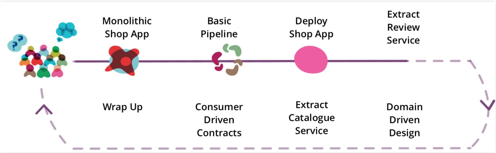
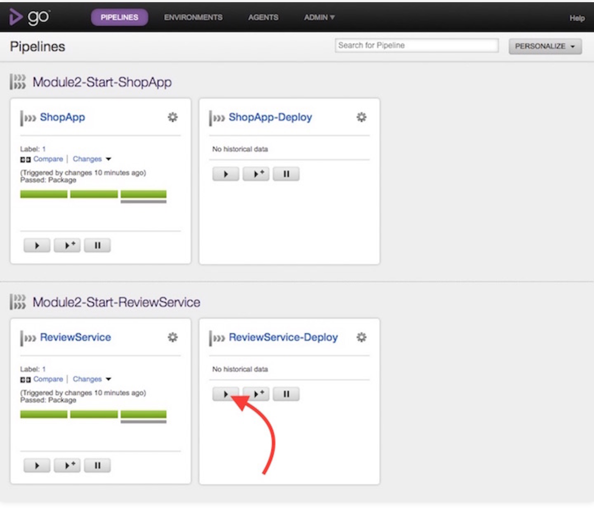
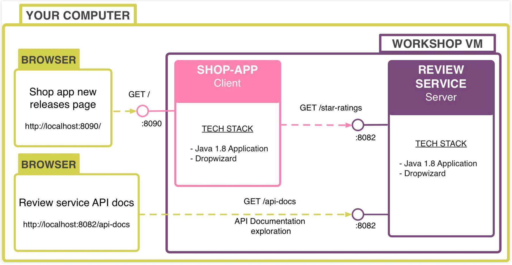



Miroservice Overview: Software architectural style where applications are composed of small, independent processes communicating with each other using language-agnostic APIs. Check online for characteristics.

Got started by the team giving us a workshop folder containing a box, and we used Vagrant to get it up and ssh into it. Just going through the steps in the slides to setup everything... The journey is the following: 

### Purpose

Purpose of using Microservice with CD (in this workshop Go-CD pipeline):
Can we actually deploy with confidence the monolith before being confident to deploy 100 microservices? That's what we're gunna go through.

Problems we usually face: It can be challenging to know when something is broken when you have 50 microservices. Is it version related? Is it because of a commit? Etc. That's why a good CI pipeline is important here to be able to quickly visualize all our microservice. With Go-CD, we have a **visual** representation of our CD system.

### Tutorial

We're taking a Musik Shop monolith app, and will it break it down into microservices. 

### Key takeaways Module 1

- Use CD Pipelines to automate your build process and provide feedback on production readiness of software
- Model your build process as a series of stages for improved feedback
- Provide scripts for building, testing, packaging and deploying your apps:
	- Store these with your app code
	- Call them from your CI/CD tool
- Build artifacts once and use them in downstream stages / pipelines
- Always tag your build artifacts with a build number
- Extend your CD pipeline to automate deployment into your environments
- Monolithic apps can be easy to build and deploy as they have less moving parts

### Module 2
The overview of our system can be seen here:

Basically, in order to extract our review service in our shop-app, we change from getStarRatingsLocalMethod() to getStarRatingsFromReviewService(). 
Notice as well the difference in Ports (8090 Vs 8082)

